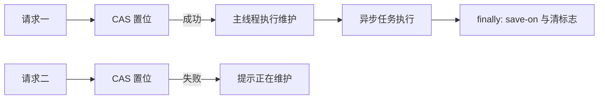

# 1. 问题

备份/优化维护任务的互斥控制存在竞态条件：在当前实现中，互斥检查发生在调用线程，而置位发生在主线程回调中，导致多个并发请求在排队到主线程之前都能通过检查，从而可能排入多个维护任务。

- 相关位置：`utils/OrzMessageParser.java` 中的 `runExclusiveMaintenance`（约 372–389 行），互斥标记声明见 22 行 `public static volatile boolean isBackupRunning = false;`。

## 1.1. **互斥检查与置位不在同一临界区**
- 代码现状：
```java
private static void runExclusiveMaintenance(Consumer<String> callback, String kickText, Runnable asyncWork) {
    if (isBackupRunning) {
        callback.accept("正在备份/优化中，请稍候...");
        return;
    }
    OrzMC.server().getScheduler().runTask(OrzMC.plugin(), () -> {
        isBackupRunning = true;
        OrzMC.server().getOnlinePlayers().forEach(p -> p.kick(Component.text(kickText)));
        OrzUtil.executeConsoleCmd(() -> callback.accept("停止服务器自动地图保存功能"), "save-off", "save-all flush");
        OrzMC.server().getScheduler().runTaskAsynchronously(OrzMC.plugin(), () -> {
            try {
                asyncWork.run();
            } finally {
                OrzUtil.executeConsoleCmd(() -> callback.accept("恢复服务器自动地图保存功能"), "save-on");
                isBackupRunning = false;
            }
        });
    });
}
```
- 问题说明：检查与置位不在同一临界区且跨线程（调用线程 vs. 主线程），多个并发请求都在 `isBackupRunning == false` 时排入主线程队列，随后各自执行，导致重复副作用与并发异步任务。
- 为什么是问题：
  - 可同时触发多次踢在线玩家、`save-off/save-on` 切换，产生重复操作与日志噪音。
  - 异步优化/备份并行执行，增加文件系统层面的冲突风险与不稳定性。

## 1.2. **重复副作用与异步并发风险**
- 现象：当备份与优化被几乎同时触发时，两者都会进入队列并在主线程各自执行踢人、`save-off` 等，再并发跑异步工作流。
- 风险：
  - 重复踢人（影响用户体验）。
  - 多次 `save-off`/`save-all flush` 切换（不可预测的时序交错）。
  - 两个优化/备份流并发访问相同世界数据，可能造成冲突或回归风险。

# 2. 收益

将互斥检查与状态置位原子化并收敛到同一临界区，可确保任何时刻最多只有一个维护任务在运行，显著降低并发风险和副作用。

## 2.1. **消除并发重复操作**
- 并发触发下的重复踢人与 `save-off/save-on` 切换被消除，避免噪音与不必要的状态抖动。
- 预计并发重复维护任务数量从可能的 **2+** 降为 **0**。

## 2.2. **提升稳定性与可预期性**
- 异步阶段不再并发访问相同资源，减少文件系统冲突与长尾失败概率。
- 维护窗口内的副作用序列更可控，日志更干净。

## 2.3. **改进可读性与可测试性**
- 明确的原子互斥协议使得单元测试与集成测试更容易构造和断言。
- 将复杂跨线程时序收敛为“一次性 CAS 置位 + finally 释放”的稳定模式。

# 3. 方案

总体方案：采用 `AtomicBoolean.compareAndSet(false, true)` 在进入维护流程的第一时间原子置位，保证一次性；在 `finally` 中释放标志。必要时在主线程入口处做二次防护。保持现有业务行为不变（踢人、`save-off/flush/save-on`），仅修正并发互斥协议。

## 3.1. **请求流与互斥控制（示意图）**



该图展示两次几乎同时的触发：只有第一个请求通过 CAS 并进入主线程维护流程；第二个请求立即提示“正在维护”。维护完成后释放标志。

## 3.2. **解决“互斥检查与置位不在同一临界区”**

- 方案概述：将 `volatile boolean` 改为 `AtomicBoolean`，在入口使用 `compareAndSet` 原子检查与置位，避免多个请求在置位之前就排队入主线程。
- 实施步骤：
  - 将 `public static volatile boolean isBackupRunning` 替换为 `public static final AtomicBoolean maintenanceRunning = new AtomicBoolean(false);`
  - 在 `runExclusiveMaintenance` 入口使用 `compareAndSet(false, true)`；失败则直接回调提示并返回。
  - 在异步任务 `finally` 中使用 `maintenanceRunning.set(false)` 释放标志。
- 修改前代码（摘录）：见“问题”章节示例。
- 修改后代码（示例）：
```java
// 22 行附近
public static final AtomicBoolean maintenanceRunning = new AtomicBoolean(false);

private static void runExclusiveMaintenance(Consumer<String> callback, String kickText, Runnable asyncWork) {
    // 原子检查并置位，保证一次性
    if (!maintenanceRunning.compareAndSet(false, true)) {
        callback.accept("正在备份/优化中，请稍候...");
        return;
    }
    OrzMC.server().getScheduler().runTask(OrzMC.plugin(), () -> {
        // 主线程副作用
        OrzMC.server().getOnlinePlayers().forEach(p -> p.kick(Component.text(kickText)));
        OrzUtil.executeConsoleCmd(() -> callback.accept("停止服务器自动地图保存功能"), "save-off", "save-all flush");
        OrzMC.server().getScheduler().runTaskAsynchronously(OrzMC.plugin(), () -> {
            try {
                // 长耗时工作
                asyncWork.run();
            } finally {
                // 始终恢复并释放互斥标志
                OrzUtil.executeConsoleCmd(() -> callback.accept("恢复服务器自动地图保存功能"), "save-on");
                maintenanceRunning.set(false);
            }
        });
    });
}
```
- 效果解释：入口 CAS 使得后续请求立即被拒绝，避免“在置位之前排队”的竞态窗口。释放在 `finally` 中执行，确保异常也能恢复状态。

## 3.3. **解决“重复副作用与异步并发风险”**

- 方案概述：入口原子互斥即可消除并发异步；可选地在主线程任务开始处加入轻量二次校验（防御式编程），提高鲁棒性。
- 实施步骤（可选）：
```java
OrzMC.server().getScheduler().runTask(OrzMC.plugin(), () -> {
    if (!maintenanceRunning.get()) {
        // 若入口 CAS 失败或已被释放，则不执行副作用
        callback.accept("维护任务已取消或已完成");
        return;
    }
    // ...副作用与异步如上
});
```
- 效果解释：即便未来维护流程被改动或存在边界时序，该二次校验也能避免无意义的重复副作用。

# 4. 回归范围

本次改动不改变业务行为，只修正并发互斥协议。需从端到端流程验证“触发 -> 维护窗口 -> 完成释放”的稳定性与可预期性。

## 4.1. 主链路
- 管理员触发备份：
  - 前置：服务器在线玩家若存在，应被踢出；`save-off` 与 `save-all flush` 执行一次。
  - 期望：维护任务执行一次，日志与提示语清晰；完成后 `save-on` 恢复。
- 管理员几乎同时触发优化：
  - 期望：第二个请求立即返回“正在维护”，不会进入维护流程；不产生重复踢人与重复 `save-off/flush`。
- 维护完成后再次触发：
  - 期望：标志已释放，可再次进入维护流程。

（用例建议）
- 并发触发用例：两线程同时调用 `backup()` 与 `optimizeWorld()`，断言仅一个进入维护，另一个收到忙提示。
- 完成释放用例：维护任务异常与正常路径下均断言最终执行 `save-on` 且标志为 `false`。

## 4.2. 边界情况
- 边界一：在维护过程中插件被禁用或调度失败。
  - 期望：`finally` 路径能够执行恢复；如不可达，人工运维指引需明确（该改动不改变现有行为）。
- 边界二：无在线玩家时的踢人逻辑。
  - 期望：无副作用错误日志；流程继续。
- 边界三：文件系统异常（磁盘满、权限问题）。
  - 期望：错误被记录；`finally` 仍执行 `save-on` 与清标志。
- 边界四：连续高频触发。
  - 期望：除第一个外，其余均立即返回忙提示，系统稳定无抖动。
