# 架构设计

核心目标：组合根显式装配模块、服务层收敛业务逻辑、适配层只做转发，
核心层沉淀端口与消息模型，基础设施提供可替换实现。

## 分层说明

- **组合根（Composition Root）**
    - `OrzServices` 作为显式组合根，按依赖顺序创建 5 个领域模块
    - `OrzMC` (JavaPlugin) 入口，仅调用 `OrzServices.assemble(this)` 和生命周期方法
- **适配层（Events/Commands）**
    - 事件监听、命令入口只采集参数并调用服务
    - `events/` 包中每个 Listener 只做参数转发
    - `commands/` 包中每个 CommandExecutor 只做参数采集与拦截器壳
- **服务层（Features）**
    - 承载业务流程与规则，依赖通过构造注入
    - 示例：`features/player/PlayerEventService`, `features/tnt/TntEventService`, `features/whitelist/WhitelistService`
- **核心层（Core / 端口与消息）**
    - `core/ports/` 定义业务端口接口（`ServerAccess`, `ServerLogger`, `ServerScheduler`, `TypedConfigProvider`）
    - `core/bot/` 定义消息模型（`MessageEnvelope`, `BotInboundHandler`）
    - `assembly/` 定义生命周期契约（`ServiceModule`, `Initializable`）
- **基础设施层（Infra）**
    - 通知、网络、限流、样式、配置、Bot 适配等实现细节
    - 示例：`infra/notify/Notifier`, `infra/logging/ThrottledLogger`, `infra/ws/RobustWebSocketClient`

## 架构设计图



## 模块构成

### 1. PlatformModule — 平台基础设施（零依赖）

```
PlatformModule
├── ServerFacade          ← 服务端门面（聚合 ServerAccess / ServerLogger / ServerScheduler）
├── ConfigService         ← YAML 配置加载与管理
├── DefaultTypedConfigProvider ← 类型化配置统一入口（通过各个 Config 记录类转型）
├── OrzTextStyles         ← 文本样式（从 templates.yml → styles 段读取，兼容旧 styles.yml）
├── ThrottledLogger       ← 日志限流
├── ThrottledNotifier     ← 通知限流
└── HealthRegistry         ← 健康状态注册与查询
```

- **config/** — 配置加载、类型化包装与健康检查
    - ConfigService, ConfigManager, ConfigHealthCheck
    - `configs/` 子包中每个配置对应一个记录类（`BotConfig`, `Styles`, `TntConfig`, `WhitelistConfig`, `Portals`, `MainConfig`, `MaintenanceConfig`, `CommandPolicies`, `TemplateOptions`, `Templates`, `NotifyPolicy`, `IpWhitelist`, `WhitelistKickMessage`）
    - `SafeKeys` 端口 YAML 键名编码（解决 '.' 被识别为层级分隔的问题）
    - `PortalsWriter` 持久化传送门配置
- **notify/** — 通知派发与限流
    - Notifier（支持自定义 NotifierSink）
    - ThrottledNotifier
- **logging/** — 日志限流
    - ThrottledLogger
- **health/** — 健康状态注册与查询
    - HealthRegistry（Status: enabled/httpOk/wsConnected/apiReady/lastError/lastUpdated）
    - HealthAccessor（桥接静态 HealthRegistry 与 HealthStatus 接口）
- **styles/** — 统一文本样式与颜色
    - OrzTextStyles（读取 templates.yml → styles 段，兼容旧 styles.yml）
- **server/** — 服务端交互
    - ServerFacade（聚合 serverAccess / serverLogger / serverScheduler）
- **net/** — HTTP 客户端封装
    - AsyncHttp（超时/重试/指数退避）
- **ws/** — WebSocket 客户端封装
    - RobustWebSocketClient（指数退避与抖动、稳定期重置）
- **bot/** — 机器人适配与路由
    - BotAdapter 接口：所有机器人适配器统一契约（isEnable / setup / teardown / send）
    - BotRouter 消息路由器：setup → flush → route 三阶段，初始化前消息自动缓存
    - OrzBotManager 创建 OrzQQBot / OrzDiscordBot / OrzLarkBot / OrzEasyBot 适配器并注入路由
    - BotReconnectionManager WebSocket 重连管理器（支持 QQ 和 EasyBot）
    - BotMessageServiceProvider 工厂创建 BotMessageService
    - OrzQQBot / OrzDiscordBot / OrzLarkBot / OrzEasyBot 各适配器实现
- **binding/** — 命令/事件注册
    - CommandBinder（使用 CommandMap API 注册命令）
    - EventBinder（注册事件监听器）
- **templates/** — 消息模板与解析
    - TemplateService, TemplateResolvers
- **paging/** — 分页
    - Paginator（白名单分页展示）

### 2. BotModule — 机器人消息模块

创建 BotCommandService → BotMessageService（QQ/Discord/Lark/EasyBot）→ Notifier 的依赖链。

```
BotModule
├── BotCommandService     ← 机器人消息解析与路由（实现 BotInboundHandler）
│   ├── 命令分发映射（OrzUserCmd 枚举 → CmdHandler）
│   ├── $a / $r / $b / $o / $e / $d / $l / $w / $h
│   ├── 统一分派：所有指令经 parse() 方法分派（消除三条代码路径分叉）
│   ├── $cmd ? 支持：在指令后加 ? 或 ？ 查询详细用法
│   ├── BotCommandFeedbackService     ← 指令反馈信息构建（帮助、用法提示）
│   ├── BotCommandListFeedbackService ← 在线列表/白名单列表构建
│   └── setMaintenanceService() / setBlacklistService() 跨模块注入
├── BotMessageService     ← QQ/Discord/Lark/EasyBot 适配器
├── Notifier              ← 通知派发（依赖 BotMessageService）
├── BotStatusService      ← 机器人状态查询
└── HealthRegistry        ← 机器人相关健康检查
```

- 循环依赖处理：BotModule 实现 `Initializable.afterPropertiesSet()`，
  在组合根完成跨模块注入后触发二阶段初始化
- 跨模块回引用：`setWorldMaintenanceService()` 向 BotCommandService 注入维护服务

### 3. PortalModule — 传送门模块

管理跨服传送门的创建、查找和移除，持久化到 portals.yml。

```
PortalModule
├── PortalService         ← 传送门业务逻辑（实现 PortalPort）
└── portals.yml           ← 运行时修改的 YAML 存储
```

- `PortalsWriter` 持久化抽象，支持未来替换存储方式

### 4. MaintenanceModule — 维护模块

```
MaintenanceModule
└── WorldMaintenanceService  ← 世界备份与地图优化
```

- 依赖 PlatformModule（ConfigService）和 BotModule（Notifier）
- 通过 BotCommandService 暴露给 $b / $o 命令

### 5. FeatureModule — 功能模块（依赖所有其他模块）

将所有 Feature 服务集中创建，并注册 Bukkit 事件监听器和命令。

**注册的事件监听器**：
- OrzBowShootEvent — 传送弓射箭事件
- OrzPlayerEvent — 玩家进出服 / 首次加入向导
- OrzTPEvent — 跨服传送
- OrzTNTEvent — TNT 检测
- OrzMenuEvent — 菜单交互
- OrzServerEvent — 服务端生命周期
- OrzWhiteListEvent — 白名单检查
- OrzDebugEvent — 调试事件
- OrzPortalEvent — 传送门交互

**注册的命令**（通过 Paper LifecycleEvents.COMMANDS + Brigadier `LiteralCommandNode`，替代旧的 CommandMap API）：
- `/guide` — 获取玩家指南
- `/menu` — 打开菜单
- `/tpbow`（别名 `/tpb`） — 获取传送弓
- `/bot` — 查看机器人状态（自动重连 WebSocket）
- `/portal` — 管理传送门（`<host> [port]` 创建，`remove <host> [port]` 移除）
- `/blacklist`（别名 `/bl`） — IP 黑名单管理（list/add/remove）
- `/config`（别名 `/cfg`） — 管理员配置管理（list/get/set/reset/dump/reload）

**命令拦截器**（`features/command/binding/`）：
- `PlayerOnlyInterceptor` — 玩家限定
- `AdminOnlyInterceptor` — OP 或 `orzmc.admin` 权限检查（通过 `.requires()` 隐藏命令）
- `CooldownInterceptor` — 秒级冷却（按 commandName|senderName 维度）
- `CooldownRegistry` — 冷却注册与管理
- 执行方式：通过 `guardedExec()` 包装 Brigadier `Command` 执行体，运行时按序检查拦截器链

**IP 黑名单**：
- `BlacklistService` 管理 IP 黑名单规则（支持通配符模式如 `192.168.*`）
- 玩家连接时 `OrzPlayerEvent` 调用 `BlacklistService.isBlacklisted()` 检查
- 黑名单存储于 `config.yml` → `ip_blacklist` 段

## 模块生命周期

`OrzServices.assemble()` 是显式组合根，严格按依赖顺序装配：

```
OrzServices.assemble(OrzMC)
  │
  ├── 1. new PlatformModule(plugin)      ← 零依赖基础设施
  │       └── platform.setup()           ← 初始化配置系统
  │
  ├── 2. new BotModule(platform)         ← 依赖 Platform
  ├── 3. new PortalModule(platform)      ← 依赖 Platform
  │
  ├── 4. new MaintenanceModule(platform, bot)  ← 依赖 Platform + Bot
  │
  ├── 5. bot.setWorldMaintenanceService(...)   ← 跨模块回引用注入
  ├── 6. bot.setBlacklistService(...)          ← IP 黑名单回引用注入
  ├── 7. ((Initializable) bot).afterPropertiesSet()  ← 二阶段初始化
  │
  ├── 8. new FeatureModule(platform, bot, portal, maintenance)  ← 依赖所有模块
  │
  └── OrzServices.setupAll(plugin)
        ├── botModule.setup()             ← 启动 Bot 连接
        ├── portalModule.setup()          ← 初始化传送门
        ├── featureModule.setupEventListeners(plugin)   ← 注册事件
        └── featureModule.setupCommandHandlers(plugin)  ← 通过 Paper LifecycleEvents.COMMANDS 注册 Brigadier 命令
```

`OrzServices.shutdownAll()` 逆序销毁：
- 先发停服通知 → BotModule.tearDown() → PortalModule.tearDown() → PlatformModule.tearDown()

## 依赖关系图

- OrzServices（入口）
    - PlatformModule 提供：ServerFacade, ConfigService, TypedConfigProvider, OrzTextStyles, ThrottledLogger, ThrottledNotifier, HealthRegistry
    - BotModule 利用 PlatformModule 创建 BotCommandService → BotMessageService → Notifier
    - PortalModule 利用 PlatformModule 创建 PortalService
    - MaintenanceModule 利用 PlatformModule + BotModule 创建 WorldMaintenanceService
    - FeatureModule 利用所有模块创建 Feature 服务并注册命令/事件

## 设计原则

- **分层清晰**：Feature 只编排业务，Infra 提供能力，Events/Commands 仅做转发
- **显式依赖**：通过构造注入与组合根装配，避免静态耦合
- **配置类型化**：集中配置记录类，默认值与迁移，附带健康检查
- **可测试性**：NotifierSink 接口便于替换，WS 通过工厂注入替身覆盖心跳/重连/异常路径
- **线程安全**：Bukkit 主线程进行方块与实体操作；异步任务做 I/O（ServerFacade 提供 runSync/runAsync）

## 配置结构

### config.yml（核心配置，合并管理）

```yaml
# config.yml 包含所有配置段：whitelist, maintenance, tnt, geoip, command_policies
# 参考 src/main/resources/config.yml
```

- 详见 `infra/config/configs/` 包中的各个记录类
- 每个配置段对应一个 record 类型（`WhitelistConfig`, `TntConfig`, `MaintenanceConfig` 等）
- 通过 `TypedConfigProvider` 统一访问：
  ```java
  TypedConfigs.WhitelistConfig wl = configs.whitelist();
  boolean forceWhitelist = wl.forceWhitelist();
  ```

### portals.yml（按服务器地址分组）

```yaml
portals:
  "example_com:25565":
    "world:100:64:200": "X"
    "world:200:64:300": "Z"
```

- 为避免 YAML 将 '.' 识别为层级分隔，写入时对地址进行安全编码：'.' → '_'
- 读取时自动解码为原始地址
- 参考：SafeKeys, PortalsWriter, Portals

### 文本样式（templates.yml → styles 段）

样式与模板统一管理在 `templates.yml` 中：

```yaml
styles:
  info: "#00AAFF"
  success: "#00FF00"
  warn: "#FFAA00"
  error: "#FF5555"
```

兼容旧 `styles.yml` 文件（自动 fallback 读取）。

### easybot.yml（EasyBot IM 网关配置）

独立于 `bot.yml`，使用专属配置记录类 `EasyBotConfig`：

```yaml
api_server: 'http://127.0.0.1:8080'
ws_server: 'ws://127.0.0.1:8080'
api_key: ''
parse_mode: 'none'
platforms:
  qq:
    enabled: false
    admin_group: 'qq:1082305302'
    player_group: ''
    admin_dm: 'qq:1092760538'
channels:
  ops-alert:
    qq: 'qq:1082305302'
```

- 支持多平台：QQ / Discord / Telegram / 飞书 / 微信
- 各平台独立配置消息路由（admin_group / player_group / admin_dm）
- `player_group` 留空时 PUBLIC 消息自动降级到 `admin_group`
- 全局开关自动检测：任一平台 `enabled=true` 即激活连接
- WebSocket 使用 PING/PONG 帧检测存活，无需应用层心跳
- 参考：`EasyBotConfig`, `OrzEasyBot`

## 命令策略（冷却/权限）

命令策略通过 `config.yml` → `command_policies` 配置，兼容旧 `commands.yml`（作为 fallback）：

```yaml
command_policies:
  tpbow:
    cooldown_secs: 3
    admin_only: false
  menu:
    cooldown_secs: 0
    admin_only: false
  portal:
    cooldown_secs: 5
    admin_only: true
```

加载与注入：
- 类型化解析：`infra/config/configs/CommandPolicies`, `CommandPolicy`
- 注册拦截器：`FeatureModule.setupCommandHandlers()`
  - `PlayerOnlyInterceptor`：玩家限定
  - `AdminOnlyInterceptor`：基于 OP 或权限节点 `orzmc.admin`（通过 `.requires()` 对用户隐藏命令）
  - `CooldownInterceptor`：按 commandName|senderName 维度进行秒级冷却
- 执行方式：通过 `guardedExec()` 包装 Brigadier `Command` 执行体，运行时按序检查拦截器链

## Bot 命令

机器人命令前缀来自 `config.yml` → `bot.cmd_prompt_char`（默认 `$`）：

| 命令 | 权限 | 说明 |
|------|------|------|
| `$a <玩家名>` | 管理员 | 添加玩家到白名单 |
| `$r <玩家名>` | 管理员 | 从白名单移除玩家 |
| `$b` | 管理员 | 地图备份 |
| `$o` | 管理员 | 地图优化 |
| `$e <命令>` | 管理员 | 执行控制台命令 |
| `$d [list|add|remove] <pattern>` | 管理员 | 添加/移除/查看 IP 黑名单 |
| `$l` | 通用 | 查看在线玩家 |
| `$w [页码]` | 通用 | 查看白名单玩家 |
| `$h` | 通用 | 查看帮助信息 |

> 💡 在任意指令后加 `?`（或 `？`）可查询该指令的详细用法（如 `$a ?`）。

参考：`features/botcommands/OrzUserCmd` 枚举、`BotCommandService`。

## 测试指南

- **单元测试**
    - 对服务类注入替身 Notifier/NotifierSink/OrzTextStyles，验证逻辑与路由
    - 对配置接口使用内存配置对象，验证默认值与路径解析
    - 对 WS 工厂注入（OrzQQBot, OrzEasyBot）验证健康状态与异常路径，心跳逻辑验证缺失应答与恢复路径
    - 对 AsyncHttp 进行重试与请求头/请求体行为验证
    - 对命令拦截器（PlayerOnlyInterceptor, AdminOnlyInterceptor, CooldownInterceptor, CooldownRegistry）分别验证
- **集成测试**
    - 使用 MockBukkit 模拟 Paper 环境，验证命令与事件完整链路（运行：`./gradlew integrationTest`）
    - 对高频事件（TNT/爆炸）启用 ThrottledLogger/Notifier 限流，验证日志与通知频率

## 关键文件索引

| 层级 | 路径 | 说明 |
|------|------|------|
| 入口 | `src/main/java/.../orzmc/OrzMC.java` | JavaPlugin 入口 |
| 组合根 | `src/main/java/.../orzmc/OrzServices.java` | 模块装配与生命周期 |
| 模块 | `assembly/PlatformModule.java` | 平台基础设施 |
| 模块 | `assembly/BotModule.java` | 机器人消息模块 |
| 模块 | `assembly/PortalModule.java` | 传送门模块 |
| 模块 | `assembly/MaintenanceModule.java` | 维护模块 |
| 模块 | `assembly/FeatureModule.java` | 功能模块（注册命令/事件） |
| 事件 | `events/` | 事件适配层（9 个监听器） |
| 命令 | `commands/` | 命令适配层（仅保留 OrzConfigCommand，其余命令已内联至 FeatureModule Brigadier 注册） |
| 配置 | `infra/config/configs/` | 类型化配置记录类（16 个，含 EasyBotConfig） |
| 配置 | `src/main/resources/easybot.yml` | EasyBot IM Gateway 默认配置 |
| 适配器 | `infra/bot/OrzEasyBot.java` | EasyBot 网关适配器（WS + HTTP） |
| 适配器 | `infra/bot/OrzQQBot.java` | QQ Bot 适配器（NapCatQQ/OneBot 11） |
| 适配器 | `infra/bot/OrzDiscordBot.java` | Discord Bot 适配器（JDA） |
| 适配器 | `infra/bot/OrzLarkBot.java` | 飞书 Bot 适配器（Webhook） |
| 路由 | `infra/bot/BotRouter.java` | 消息路由器（setup/flush/route） |
| 重连 | `infra/bot/BotReconnectionManager.java` | WebSocket 重连管理器 |
| 拦截器 | `features/command/binding/` | 命令拦截器（5 个文件：4 拦截器 + CooldownRegistry） |
| 命令注册 | `assembly/FeatureModule.java` | 通过 Paper LifecycleEvents.COMMANDS + Brigadier 注册（替代 CommandMap API） |
| 绑定 | `infra/binding/EventBinder.java` | 事件监听器注册 |
| 端口 | `orzmc-api/src/main/java/.../orzmc/core/ports/` | 纯 Java 接口 |
| 消息 | `orzmc-api/src/main/java/.../orzmc/core/bot/` | 消息模型 |
| 配置 | `src/main/resources/paper-plugin.yml`  | Paper 插件声明（替代旧 plugin.yml） |
