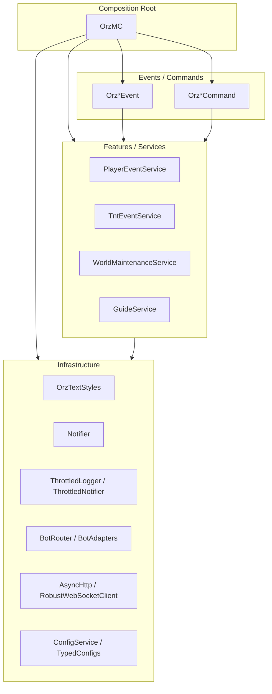

# 架构设计

核心目标：组合根显式装配、服务层收敛业务逻辑、适配层只做转发，基础设施提供可替换实现。

## 分层说明

- 组合根（Composition Root）
    - 入口：OrzMC
    - 负责实例化并装配：OrzTextStyles / Notifier / Throttled* / ConfigService 等依赖
- 适配层（Events/Commands）
    - 事件监听、命令入口只采集参数并调用服务
    - 示例：OrzPlayerEvent、OrzTNTEvent、OrzTPBow、OrzMenuCommand
- 服务层（Features/Use Cases）
    - 承载业务流程与规则，依赖通过构造注入
    - 示例：PlayerEventService、TntEventService、WorldMaintenanceService
- 基础设施层（Infra）
    - 通知、网络、限流、样式、配置、Bot 适配等实现细节
    - 示例：Notifier、ThrottledLogger、ThrottledNotifier、BotRouter、RobustWebSocketClient

## 架构设计图

PNG 版本：




## 架构/模块职责

- Infra 层（基础设施能力）
    - config：配置加载、包装与健康检查
        - ConfigService/AdvancedConfigManager/ConfigManager/ConfigWrapper/ConfigHealthCheck
    - notify：限流与事件派发
        - ThrottledNotifier、Notifier(支持自定义 NotifierSink)
    - logging：日志限流
        - ThrottledLogger
    - health：健康状态注册与查询
        - HealthRegistry(Status: enabled/httpOk/wsConnected/apiReady/lastError/lastUpdated)
    - styles：统一文本样式与颜色
        - OrzTextStyles（读取 styles.yml）
    - server：服务端交互
        - OrzUtil（控制台命令执行、成功/失败/警告文本）
    - net：HTTP 客户端封装
        - AsyncHttp（超时/重试/退避）
    - ws：WebSocket 客户端封装
        - RobustWebSocketClient/WebSocketEventListener（指数退避与抖动、稳定期重置）
    - core：通用常量
        - OrzConstants（TPBOW_KEY、告警前缀）
    - templates：消息模板与解析
        - TemplateService/TemplateResolvers/ExceptionFormatter
    - bot：机器人适配与路由
        - BotMessageServiceProvider/OrzBotManager/BotRouter
    - scheduler/paging：调度与分页
        - Schedulers/Paginator
    - portal：传送门基础模型
        - IPortalService/PortalInfo
- Feature 层（业务编排）
    - 维护、传送门、玩家/TNT/白名单事件、菜单、传送弓、新手指南等
    - 依赖 Infra 能力进行配置读取、通知派发、样式渲染与服务端交互

## 依赖关系图（简述）

- OrzMC（入口）
    - 组合根负责实例化与装配 ConfigService/OrzTextStyles/Throttled*/Notifier
    - 通过 BotMessageServiceProvider 创建 BotMessageService
- 事件/功能（features.*）
    - 读取配置：infra.config.ConfigService
    - 渲染样式：infra.styles.OrzTextStyles
    - 服务端交互：infra.server.OrzUtil
    - 通知派发：infra.notify.Notifier
    - 健康状态：infra.health.HealthRegistry
    - 网络与WS：infra.net.AsyncHttp、infra.ws.RobustWebSocketClient

## 设计原则

- 分层清晰：Feature 只编排业务，Infra 提供能力
- 显式依赖：通过构造注入与组合根装配，避免静态耦合
- 配置类型化：集中 TypedConfigs/默认值与迁移
- 可测试性：NotifierSink/接口封装便于替换与隔离外部交互
- 线程安全：Bukkit 主线程进行方块与实体操作；异步任务做 I/O

## 类型化配置示例

- Styles（styles.yml）
    - [TypedConfigs.Styles](file:///Users/bytedance/Documents/OrzMC/plugin/src/main/java/com/jokerhub/paper/plugin/orzmc/infra/config/TypedConfigs.java#L174-L195)
      统一颜色键与默认值
    - [OrzTextStyles.java](file:///Users/bytedance/Documents/OrzMC/plugin/src/main/java/com/jokerhub/paper/plugin/orzmc/infra/styles/OrzTextStyles.java#L11-L19)
      通过类型化读取颜色
- Portals（portals.yml）
    - [TypedConfigs.Portals](file:///Users/bytedance/Documents/OrzMC/plugin/src/main/java/com/jokerhub/paper/plugin/orzmc/infra/config/TypedConfigs.java#L196-L235)
      统一中心坐标/轴向与目标地址
    - 健康检查：端口范围与键格式校验 [ConfigHealthCheck.validatePortals](file:///Users/bytedance/Documents/OrzMC/plugin/src/main/java/com/jokerhub/paper/plugin/orzmc/infra/config/ConfigHealthCheck.java#L22-L42)
    - 写入器抽象：[PortalsWriter](file:///Users/bytedance/Documents/OrzMC/plugin/src/main/java/com/jokerhub/paper/plugin/orzmc/infra/config/PortalsWriter.java)
      支持未来替换存储方式
        - 接入位置：[PortalService.saveToStorage](file:///Users/bytedance/Documents/OrzMC/plugin/src/main/java/com/jokerhub/paper/plugin/orzmc/infra/portal/PortalService.java#L219-L230)

## 策略拦截器示例

- 定义拦截器
    - AdminOnlyInterceptor：管理员权限校验
    - CooldownInterceptor：命令冷却控制
- 注册与使用
    - 在 OrzMC.setupCommandHandler 中，根据 commands.yml 的策略为每个命令注入拦截器链
    - 参见 [InterceptorExecutor.java](file:///Users/bytedance/Documents/OrzMC/plugin/src/main/java/com/jokerhub/paper/plugin/orzmc/infra/binding/InterceptorExecutor.java)

## 序列图（文本示意）

```
OrzMC.onEnable
  -> new ConfigService
  -> new OrzTextStyles/ThrottledLogger/ThrottledNotifier
  -> new BotCommandService
  -> BotMessageServiceProvider.create(...)
  -> new Notifier
  -> configService.setup
  -> botMessageService.setup
  -> portalService.setup
  -> setupEventListener(EventBinder.bind)
  -> setupCommandHandler(CommandBinder.bind)
```

## 示例代码段

- 类型化策略读取

```java
FileConfiguration cmdsCfg = configService.getConfig("commands");
TypedConfigs.CommandPolicies cp = TypedConfigs.CommandPolicies.from(cmdsCfg);
TypedConfigs.CommandPolicy p = cp.policies().getOrDefault("portal", new TypedConfigs.CommandPolicy(0, false));
```

- 命令拦截器接入

```java
List<CommandInterceptor> list = new ArrayList<>();
list.add(new PlayerOnlyInterceptor());
list.add(new AdminOnlyInterceptor(p.adminOnly()));
list.add(new CooldownInterceptor("portal", p.cooldownSeconds()));
CommandBinder.bind(this, Map.of("portal", new InterceptorExecutor("portal", new OrzPortalCommand(portalService, textStyles), list)));
```

## 命令用法

- /bot
    - 查看机器人健康状态
- /portal
    - 创建传送门：/portal <host> [port]
    - 移除传送门：/portal remove <host> [port] 或 /portal rm <host> [port]
    - 需 OP 权限

## 命令策略（冷却/权限）

- 配置示例（commands.yml）

```yaml
commands:
  tpbow:
    cooldown_secs: 5
    admin_only: false
  menu:
    cooldown_secs: 5
    admin_only: false
  portal:
    cooldown_secs: 5
    admin_only: true
```
备注：如需为 bot/guide 等其他命令设置策略，可在 commands.yml 中自行新增条目。

- 加载与注入
    - 类型化解析：[TypedConfigs.CommandPolicies](file:///Users/bytedance/Documents/OrzMC/plugin/src/main/java/com/jokerhub/paper/plugin/orzmc/infra/config/TypedConfigs.java)
    - 注册拦截器：[OrzMC.setupCommandHandler](file:///Users/bytedance/Documents/OrzMC/plugin/src/main/java/com/jokerhub/paper/plugin/orzmc/OrzMC.java)
        - PlayerOnlyInterceptor：玩家限定
        - AdminOnlyInterceptor：基于 OP 或权限节点 orzmc.admin
        - CooldownInterceptor：按 commandName|senderName 维度进行秒级冷却
    - 执行器：[InterceptorExecutor.java](file:///Users/bytedance/Documents/OrzMC/plugin/src/main/java/com/jokerhub/paper/plugin/orzmc/infra/binding/InterceptorExecutor.java)

## Portals 配置结构（按服务器地址分组）

```
portals:
  "example_com:25565":
    "world:100:64:200": "X"
    "world:200:64:300": "Z"
```

- 说明
    - 为避免 YAML 将 '.' 识别为层级分隔，写入时对地址进行安全编码：将 '.' 替换为 '_'，如 mc.jokerhub.cn:25565 →
      mc_jokerhub_cn:25565
    - 读取时自动解码为原始地址使用
    - 参考：[SafeKeys.java](file:///Users/bytedance/Documents/OrzMC/plugin/src/main/java/com/jokerhub/paper/plugin/orzmc/infra/config/SafeKeys.java) [PortalsWriter.java](file:///Users/bytedance/Documents/OrzMC/plugin/src/main/java/com/jokerhub/paper/plugin/orzmc/infra/config/PortalsWriter.java) [TypedConfigs.Portals.from](file:///Users/bytedance/Documents/OrzMC/plugin/src/main/java/com/jokerhub/paper/plugin/orzmc/infra/config/TypedConfigs.java#L225-L241)

## 调用示例

- 事件派发
    - notifier.event("tnt_alert", envelope)
- 控制台命令
    - com.jokerhub.paper.plugin.orzmc.infra.server.OrzUtil.executeConsoleCmd(() -> {}, "save-all")
- 样式渲染
    - styles.warn("仅 OP 可用")
- 注入自定义通知器
    - notifier.registerSink(customSink)

## 测试指南

- 单元测试
    - 对服务类注入替身 Notifier/NotifierSink/OrzTextStyles，验证逻辑与路由
    - 对配置接口 TypedConfigs 使用内存配置对象，验证默认值与路径解析
- 集成测试
    - 使用 Paper 的 TestServer 启动环境，验证命令与事件行为
    - 对高频事件（TNT/爆炸）启用 ThrottledLogger/Notifier 限流，验证日志与通知频率
