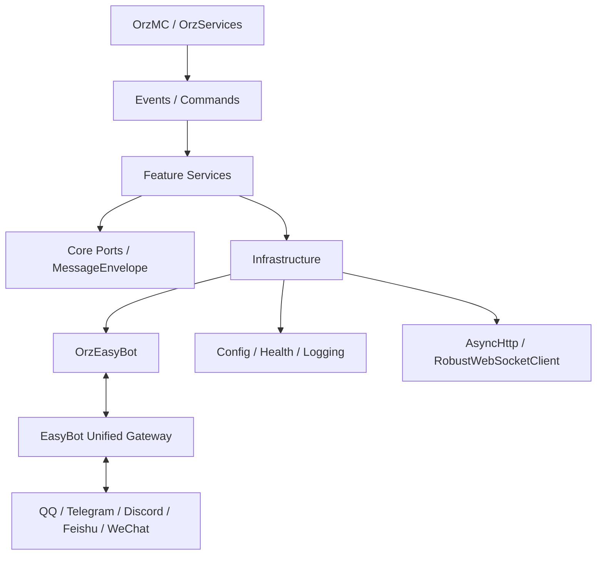

# 架构设计

核心目标：组合根显式装配模块、服务层收敛业务逻辑、适配层只做转发，
核心层沉淀端口与消息模型，基础设施提供可替换实现。

## 分层说明

- **组合根（Composition Root）**
    - `OrzServices` 作为显式组合根，按依赖顺序创建 6 个领域模块
    - `OrzMC` (JavaPlugin) 入口，仅调用 `OrzServices.assemble(this)` 和生命周期方法
- **适配层（Events/Commands）**
    - 事件监听、命令入口只采集参数并调用服务
    - `events/` 包中每个 Listener 只做参数转发
    - `commands/` 包中每个 CommandExecutor 只做参数采集与拦截器壳
- **服务层（Features）**
    - 承载业务流程与规则，依赖通过构造注入
    - 示例：`features/player/LoginAccessControlService`, `features/player/PlayerEventService`, `features/tnt/TntEventService`, `features/whitelist/WhitelistService`
- **核心层（Core / 端口与消息）**
    - `core/ports/` 定义业务端口接口（`ServerAccess`, `ServerLogger`, `ServerScheduler`, `TypedConfigProvider`）
    - `core/bot/` 定义消息模型（`MessageEnvelope`, `BotInboundHandler`）
    - `assembly/` 定义生命周期契约（`ServiceModule`, `Initializable`）
- **基础设施层（Infra）**
    - 通知、网络、限流、样式、配置、Bot 适配等实现细节
    - 示例：`infra/notify/Notifier`, `infra/logging/ThrottledLogger`, `infra/ws/RobustWebSocketClient`

## 架构设计图


```mermaid
flowchart TD
    Plugin["OrzMC / OrzServices"] --> Adapters["Events / Commands"]
    Adapters --> Features["Feature Services"]
    Features --> Ports["Core Ports / MessageEnvelope"]
    Features --> Infra["Infrastructure"]
    Infra --> EasyBot["OrzEasyBot"]
    EasyBot <--> Gateway["EasyBot Unified Gateway"]
    Gateway <--> Platforms["QQ / Telegram / Discord / Feishu / WeChat"]
    Infra --> Config["Config / Health / Logging"]
    Infra --> Network["AsyncHttp / RobustWebSocketClient"]
```

## 模块构成

### 1. PlatformModule — 平台基础设施（零依赖）

```
PlatformModule
├── ServerFacade          ← 服务端门面（聚合 ServerAccess / ServerLogger / ServerScheduler）
├── ConfigService         ← YAML 配置加载与管理
├── DefaultTypedConfigProvider ← 类型化配置统一入口（通过各个 Config 记录类转型）
├── OrzTextStyles         ← 文本样式（从 templates.yml → styles 段读取）
├── ThrottledLogger       ← 日志限流
├── ThrottledNotifier     ← 通知限流
└── HealthRegistry         ← 健康状态注册与查询
```

- **config/** — 配置加载、类型化包装与健康检查
    - ConfigService, ConfigManager, ConfigHealthCheck
    - schema 自动升级（ConfigSchema / ConfigUpgrader / DefaultsMerger / LegacyDefaultFlips）：
      版本门控的备份→补缺→旧默认翻转→回写，规则见 [配置 Schema 升级治理规范](dev/config-schema-governance.md)
    - `configs/` 子包中每个配置段对应一个记录类（共 23 个：`BotConfig`, `Styles`, `TntConfig`, `WhitelistConfig`, `WhitelistKickMessage`, `Portals`, `MaintenanceConfig`, `CommandPolicies`, `CommandPolicy`, `TemplateOptions`, `Templates`, `ChatConfig`, `SecurityGuardConfig`, `LoginRateLimitConfig`, `ExploitHardeningConfig`, `RankColorsConfig`, `PrisonConfig`, `UpdateConfig`, `EntityTeleportConfig`, `GamemodeCorrectionConfig`, `IpWhitelist`, `PlayerNotifyConfig`, `EasyBotConfig`）
    - `SafeKeys` YAML 键名安全编码（解决 '.' 被识别为层级分隔的问题）
    - `PortalsWriter` 持久化传送门配置
- **notify/** — 通知派发与限流
    - Notifier（支持自定义 NotifierSink）
    - ThrottledNotifier
- **logging/** — 日志限流
    - ThrottledLogger
- **health/** — 健康状态注册与查询
    - HealthRegistry（Status: enabled/httpOk/httpChecked/wsConnected/apiReady/lastError/lastUpdated）
    - HealthAccessor（桥接实例化 HealthRegistry 与 HealthStatus 接口）
- **styles/** — 统一文本样式与颜色
    - OrzTextStyles（读取 templates.yml → styles 段）
- **server/** — 服务端交互
    - ServerFacade（聚合 serverAccess / serverLogger / serverScheduler）
- **net/** — HTTP 客户端封装
    - AsyncHttp（超时/重试/指数退避）
- **ws/** — WebSocket 客户端封装
    - RobustWebSocketClient（指数退避与抖动、稳定期重置）
- **bot/** — 机器人适配与路由
    - BotMessageService：业务层使用的统一消息服务契约
    - BotMessageServiceProvider：创建 EasyBot 消息服务
    - OrzEasyBot：统一处理多平台入站事件、出站路由、健康状态和重连
- **binding/** — 命令/事件注册
    - EventBinder（注册事件监听器）
- **templates/** — 消息模板与解析
    - TemplateService, TemplateResolvers
- **paging/** — 分页
    - Paginator（白名单分页展示）

### 2. BotModule — 机器人消息模块

创建 BotCommandService → BotMessageService（EasyBot）→ Notifier 的依赖链。

```
BotModule
├── BotCommandService     ← 机器人消息解析与路由（实现 BotInboundHandler）
│   ├── 命令分发映射（OrzUserCmd 枚举 → CmdHandler）
│   ├── $a / $r / $b / $o / $e / $d / $l / $w / $h / $v / $p（11 个）
│   ├── 统一分派：所有指令经 parse() 方法分派（消除三条代码路径分叉）
│   ├── $cmd ? 支持：在指令后加 ? 或 ？ 查询详细用法
│   ├── BotCommandFeedbackService     ← 指令反馈信息构建（帮助、用法提示）
│   ├── BotCommandListFeedbackService ← 在线列表/白名单列表构建（含权限组展示）
│   └── setMaintenanceService() / setAccessRuleService() / setReviewService() / setRankService() 跨模块注入
├── BotMessageService     ← EasyBot 统一网关消息服务
├── Notifier              ← 通知派发（依赖 BotMessageService）
├── BotStatusService      ← 机器人状态查询
└── HealthRegistry        ← 机器人相关健康检查
```

- 循环依赖处理：BotModule 实现 `Initializable.afterPropertiesSet()`，
  在组合根完成跨模块注入后触发二阶段初始化
- 跨模块回引用：`setWorldMaintenanceService()` 向 BotCommandService 注入维护服务；
  `setReviewService()` / `setRankService()` 注入审核与权限服务（供 `$v` / `$p` 使用），
  注入 rankService 时重建列表反馈服务（在线列表显示权限组）

### 3. PortalModule — 传送门模块

管理跨服传送门的创建、查找和移除，持久化到 portals.yml。

```
PortalModule
├── PortalService         ← 传送门业务逻辑（实现 PortalPort）
└── portals.yml           ← 运行时修改的 YAML 存储
```

- `PortalsWriter` 持久化抽象，支持未来替换存储方式

### 4. MaintenanceModule — 维护模块

```
MaintenanceModule
└── WorldMaintenanceService  ← 世界备份与地图优化
```

- 依赖 PlatformModule（ConfigService）和 BotModule（Notifier）
- 通过 BotCommandService 暴露给 $b / $o 命令

### 4.5 UpdateModule — 插件自更新模块

```
UpdateModule
├── UpdateService        ← 版本判定 / sha256 校验下载（纯后台，无 Bukkit 依赖）
├── UpdateCommandService ← /update check|now 命令服务
├── HangarClient        ← Hangar API v1 只读客户端（最新版/下载直链/sha256）
└── BuildInfo           ← 读取构建期烘焙的 orzmc-build.properties（版本串 + HEAD 时间）
```

- 依赖 PlatformModule（ServerFacade / TypedConfigProvider）；装配于 MaintenanceModule 之后、FeatureModule 之前
- 版本比对用「发布串 + 构建时间」，与 Hangar 通道 `release`/`beta` 对齐；调度链走 global region，网络/文件 IO 走异步线程，Folia 安全
- 下载目标 `plugins/update/`，文件名保持平台原名（`Hangar fileInfo.name`，如 `OrzMC-1.0.24.jar`）；sha256 通过后原子落盘，重启后 Paper 按插件元数据 name 匹配完成替换

### 5. FeatureModule — 功能模块（依赖所有其他模块）

将所有 Feature 服务集中创建，并注册 Bukkit 事件监听器和命令。

**注册的事件监听器**：
- OrzBowShootEvent — 传送弓射箭事件
- OrzPlayerEvent — 登录访问控制 / 玩家进出服 / 首次加入向导
- OrzTPEvent — 跨服传送
- OrzTNTEvent — TNT 检测
- OrzMenuEvent — 菜单交互
- OrzServerEvent — 服务端生命周期
- OrzWhiteListEvent — 白名单检查
- OrzDebugEvent — 调试事件
- OrzPortalEvent — 传送门交互
- OrzRankEvent — 权限/晋升相关事件

**注册的命令**（通过 Paper LifecycleEvents.COMMANDS + Brigadier `LiteralCommandNode`，替代旧的 CommandMap API）：
命令树按特性拆到 `assembly/` 下独立的 `XxxCommandRegistrar`（一个文件一个特性），由
`FeatureCommandRegistrar` 在事件里统一编排；下列命令仍内联于协调器：guide/menu/tpbow、`/bot`、`/orzdebug`、`/maintenance`。
- `/guide` — 获取玩家指南
- `/menu` — 打开菜单
- `/tpbow`（别名 `/tpb`） — 获取传送弓
- `/bot` — 查看机器人状态（自动重连 WebSocket）
- `/portal` — 管理传送门（`<host> [port]` 创建，`remove <host> [port]` 移除）
- `/blacklist`（别名 `/bl`） — IP 黑名单与玩家名规则管理（list/add/remove）
- `/config`（别名 `/cfg`） — 管理员配置管理（list/get/set/reset/dump/reload）
- `/apply` — 玩家提交/查询/撤回审核申请（如 `/apply builder [理由]`）
- `/review approve|reject <玩家>` — 管理员审核申请
- `/rank [玩家]` — 查询权限组与晋升进度（admin 可查指定玩家）
- `/orzdebug <Bot命令>` — 模拟群里用户发 Bot 命令（调试用）
- `/update check|now`（别名 `/upd`） — 检查/下载插件自更新（管理员，见 4.5 UpdateModule）

**命令拦截器**（`features/command/binding/`）：
- `PlayerOnlyInterceptor` — 玩家限定
- `AdminOnlyInterceptor` — OP 或 `orzmc.admin` 权限检查（通过 `.requires()` 隐藏命令）
- `CooldownInterceptor` — 秒级冷却（按 commandName|senderName 维度）
- `CooldownRegistry` — 冷却注册与管理
- 执行方式：通过 `guardedExec()` 包装 Brigadier `Command` 执行体，运行时按序检查拦截器链

**访问规则**：
- `AccessRuleService` 统一管理 IP 黑名单（精确/CIDR/通配符）与玩家名规则（exact/prefix/suffix/contains/glob/regex）
- 玩家连接时 `LoginAccessControlService` 统一编排 prelogin：IP 黑名单 → 玩家名规则 → GeoIP 地区白名单
- 运行时规则存储于 `access_rules.yml`（取代旧 `ip_blacklist.yml`，不再自动迁移存量数据）

## 模块生命周期

`OrzServices.assemble()` 是显式组合根，严格按依赖顺序装配：

```
OrzServices.assemble(OrzMC)
  │
  ├── 1. new PlatformModule(plugin)      ← 零依赖基础设施
  │       └── platform.setup()           ← 初始化配置系统
  │
  ├── 2. new BotModule(platform)         ← 依赖 Platform
  ├── 3. new PortalModule(platform)      ← 依赖 Platform
  ├── 4. new MaintenanceModule(platform, bot)  ← 依赖 Platform + Bot
  ├── 4.5 new UpdateModule(platform)     ← 依赖 Platform（自更新）
  ├── 5. new FeatureModule(platform, bot, portal, maintenance, update)  ← 依赖所有模块
  │
  ├── 6. bot.botCommandService().injectDependencies(...)   ← Feature → Bot 跨模块回引用注入
  │
  └── OrzServices.setupAll(plugin)
        ├── botModule.setup()            ← 启动 Bot 连接
        ├── portalModule.setup()         ← 初始化传送门
        ├── maintenanceModule.setup()    ← 维护模块启动
        ├── updateModule.setup()         ← 排首轮自更新检查（异步，不阻塞启动）
        ├── featureModule.setupEventListeners(plugin)   ← 注册事件
        ├── featureModule.setupCommandHandlers(plugin)  ← 注册 Brigadier 命令（含 /update）
        └── featureModule.enableForceWhitelist(plugin)  ← 应用白名单配置
```

`OrzServices.shutdownAll()` 逆序销毁：
- 冲刷上下线聚合批次 → 通知停服 → BotModule.tearDown() → PortalModule.tearDown() → MaintenanceModule.tearDown() → UpdateModule.tearDown() → PlatformModule.tearDown()

## 依赖关系图

- OrzServices（入口）
    - PlatformModule 提供：ServerFacade, ConfigService, TypedConfigProvider, OrzTextStyles, ThrottledLogger, ThrottledNotifier, HealthRegistry
    - BotModule 利用 PlatformModule 创建 BotCommandService → BotMessageService → Notifier
    - PortalModule 利用 PlatformModule 创建 PortalService
    - MaintenanceModule 利用 PlatformModule + BotModule 创建 WorldMaintenanceService
    - UpdateModule 利用 PlatformModule 创建 UpdateService + UpdateCommandService（HangarClient / BuildInfo）
    - FeatureModule 利用所有模块创建 Feature 服务并注册命令/事件

## AI 智能体编辑路径（改 X → 读 Y）

> 供 AI 编码时按「最小必读集」取上下文，减少无关 token。各包更细锚点见对应 `package-info.java`。
> 成本规则：先读 package-info（约 10 行）定位，再定向读下表的文件，勿整读全层。

| 想改 | 必读文件（最小集） |
|---|---|
| 某特性命令的参数/权限/文案 | `assembly/<Feat>CommandRegistrar.java` + `features/<feat>/` 对应服务 + `features/command/binding/`（拦截器/文案） |
| 增删一个命令组 | `assembly/FeatureCommandRegistrar.java`（协调器 groups 列表）+ 新建/删除 `assembly/<Feat>CommandRegistrar.java` + 对应 `features/<feat>/` 服务 |
| **rank/review/prison 任一逻辑** | **三包同读**（`features/rank` + `features/review` + `features/prison`，属同一 LP 权限治理簇，见 package-info）+ `assembly/FeatureModule.java` 接线段 + LP 软依赖（`LuckPermsBootstrap`/`LuckPermsPromoter`/`LuckPermsPrisonStore`/Noop 降级）+ `events/OrzRankEvent`/`OrzRankDisplayEvent`/`OrzPrisonEvent` |
| 新增/改一个配置字段 | `infra/config/configs/XxxConfig.java`（默认值+解析）+ `infra/config/ConfigHealthCheck.java` 对应 `validateXxxSection`（P2 计划下沉）+ 若需运行时重载则挂 `OrzConfigCommand.setXxxReload`（`FeatureModule.setupEventListeners`） |
| 改命令冷却/权限策略 | `features/command/binding/`（拦截器链）+ `infra/config/configs/CommandPolicies` + `assembly/BrigadierSupport` |
| 改 Bot `$` 命令 | `features/botcommands/<Xxx>CommandHandler.java` + 目标 `features/<feat>/` 服务；新增依赖时改 `BotCommandDependencies` + `OrzServices.assemble` 注入段 |
| 改事件响应 | `events/OrzXxxEvent.java`（薄适配器）+ `features/<feat>/<Feat>EventService.java` |
| 改启动装配/接线顺序 | `OrzServices.assemble/setupAll` + `assembly/FeatureModule.java` 构造函数（跨特性 DAG，勿乱动次序） |
| 改群通知/站内消息文案模板 | `src/main/resources/templates.yml` + `features/<feat>/` 的渲染/Notifier + `infra/templates` |
| 改配置 schema 迁移/旧默认翻转 | `infra/config/ConfigUpgrader.java` + `LegacyDefaultFlips.java` + `DefaultsMerger.java`（版本门控，勿手改存量文件） |
| 新增一个 feature | 建 `features/<feat>/`（服务 + package-info）→ 需要事件则加 `events/OrzXxxEvent` → 命令则加 `assembly/<Feat>CommandRegistrar` + 注册进协调器 → `FeatureModule` 装配接线 → 配置段/默认/校验 → 测试 |

## 模块边界与已知取舍

> 完整路线图问题清单见 [roadmap/code-quality-roadmap.md](roadmap/code-quality-roadmap.md)；本文只记与「分层理解」直接相关的边界规则与决策。

### orzmc-api 子模块边界（逻辑包跨模块分裂）

逻辑包 `com.jokerhub.paper.plugin.orzmc.core.*` 实际分处两个模块：

| 位置 | 内容 | 约束 |
|:--|:--|:--|
| `orzmc-api/`（独立 artifact，发布 Maven Local） | 纯 Java 资产：`core/bot`（MessageEnvelope/BotInboundHandler）、`core/ports/health`、`core/ports/server`（ServerLogger/ServerScheduler）、`assembly`（ServiceModule/Initializable） | **零 Bukkit import**（A4 已闭环并有 grep 核验）；可独立发布 |
| 主模块 `src/.../core/ports/` | Bukkit 绑定端口：`server/ServerAccess`（返回 `org.bukkit.Server`）、`portal/*`（含 `Location`/`Player` 等）、`config/TypedConfigProvider` | 无法入纯模块，留在主模块 |

**判据**：可发布为 SDK 的**稳定**资产 → orzmc-api；绑定 Bukkit 类型或**高频演进**的资产 → 主模块。典型对照：消息模型/调度端口稳定 → 已入 orzmc-api；配置模型每周演进（近 30 commit 改 50 次）→ 刻意留在 infra。

### 已知取舍（决策记录）

| # | 取舍 | 决策 | 原因 |
|:--|:--|:--|:--|
| A5 | `core/ports/config/TypedConfigProvider` 反向 import `infra.config.configs.*`（19 个记录类型） | **保留现状**（2026-09-03 复核） | 配置记录依赖 Bukkit `ConfigurationSection` 解析无法入纯 api；33+ 调用点直连 infra 记录已是现实；纯化将回退「校验随 schema 落位 record」（#250/#251）成果。缓解：建议补一条依赖方向守卫测试禁止 `core → infra` import，防止扩散 |
| A7 | `enableForceWhitelist` 无条件覆盖服务器 gamemode | **待产品确认** | false 分支应「不触碰运维手动配置」还是「显式关闭」？主路径（默认 true）不受影响，等实际事故证据再改 |

## 设计原则

- **分层清晰**：Feature 只编排业务，Infra 提供能力，Events/Commands 仅做转发
- **显式依赖**：通过构造注入与组合根装配，避免静态耦合
- **配置类型化**：集中配置记录类，默认值与迁移，附带健康检查
- **可测试性**：NotifierSink 接口便于替换，WS 通过工厂注入替身覆盖心跳/重连/异常路径
- **线程安全**：Bukkit 主线程进行方块与实体操作；异步任务做 I/O（ServerFacade 提供 runSync/runAsync）

## 配置结构

### config.yml（核心配置，合并管理）

```yaml
# config.yml 包含所有配置段：whitelist, maintenance, tnt, geoip, command_policies,
# player_notify, entity_teleport_*, guard, chat, login_rate_limit, exploit_hardening
# 参考 src/main/resources/config.yml
```

- 详见 `infra/config/configs/` 包中的各个记录类
- 每个配置段对应一个 record 类型（`WhitelistConfig`, `TntConfig`, `MaintenanceConfig` 等）
- 通过 `TypedConfigProvider` 统一访问：
  ```java
  TypedConfigs.WhitelistConfig wl = configs.whitelist();
  boolean forceWhitelist = wl.forceWhitelist();
  ```

### portals.yml（按服务器地址分组）

```yaml
portals:
  "example_com:25565":
    "world:100:64:200": "X"
    "world:200:64:300": "Z"
```

- 为避免 YAML 将 '.' 识别为层级分隔，写入时对地址进行安全编码：'.' → '_'
- 读取时自动解码为原始地址
- 参考：SafeKeys, PortalsWriter, Portals

### 文本样式（templates.yml → styles 段）

样式与模板统一管理在 `templates.yml` 中：

```yaml
styles:
  info: "#00AAFF"
  success: "#00FF00"
  warn: "#FFAA00"
  error: "#FF5555"
```

### easybot.yml（EasyBot IM 网关配置）

机器人连接、路由及通用 Bot 设置统一存放在 `easybot.yml`：

```yaml
api_server: 'http://127.0.0.1:8080'
ws_server: 'ws://127.0.0.1:8080'
api_key: ''
parse_mode: 'none'
cmd_prompt_char: '$'
discord_server_link: ''
qq_group_id: ''
log_throttle_ms: 5000
platforms:
  qq:
    enabled: false
    admin_group: 'qq:conv_xxxxxxxx'
    player_group: ''
    admin_dm: 'qq:conv_yyyyyyyy'
```

- 支持多平台：QQ / Discord / Telegram / 飞书 / 微信
- 各平台独立配置消息路由（admin_group / player_group / admin_dm）
- `player_group` 留空时 PUBLIC 消息自动降级到 `admin_group`
- 全局开关自动检测：任一平台 `enabled=true` 即激活连接
- WebSocket 使用 PING/PONG 帧检测存活，无需应用层心跳
- 参考：`EasyBotConfig`, `OrzEasyBot`

## 命令策略（冷却/权限）

命令策略通过 `config.yml` → `command_policies` 配置：

```yaml
command_policies:
  tpbow:
    cooldown_secs: 3
    admin_only: false
  menu:
    cooldown_secs: 0
    admin_only: false
  portal:
    cooldown_secs: 5
    admin_only: true
```

加载与注入：
- 类型化解析：`infra/config/configs/CommandPolicies`, `CommandPolicy`
- 注册拦截器：`FeatureModule.setupCommandHandlers()`
  - `PlayerOnlyInterceptor`：玩家限定
  - `AdminOnlyInterceptor`：基于 OP 或权限节点 `orzmc.admin`（通过 `.requires()` 对用户隐藏命令）
  - `CooldownInterceptor`：按 commandName|senderName 维度进行秒级冷却
- 执行方式：通过 `guardedExec()` 包装 Brigadier `Command` 执行体，运行时按序检查拦截器链

## Bot 命令

机器人命令前缀来自 `easybot.yml` → `cmd_prompt_char`（默认 `$`）：

| 命令 | 权限 | 说明 |
|------|------|------|
| `$a <玩家名>` | 管理员 | 添加玩家到白名单 |
| `$r <玩家名>` | 管理员 | 从白名单移除玩家 |
| `$b` | 管理员 | 地图备份 |
| `$o` | 管理员 | 地图优化 |
| `$e <命令>` | 管理员 | 执行控制台命令 |
| `$d <IP>` / `$d -<IP>` / `$d player <type> <value>` / `$d -player <type> <value>`（type: `exact`/`prefix`/`suffix`/`contains`/`glob`/`regex`） | 管理员 | 添加/移除/查看 IP 黑名单与玩家名规则 |
| `$v [l|y|n] <玩家>` | 管理员 | 查看/处理审核申请（`$v l` 列表 / `$v y`/`yes` 通过 / `$v n`/`no` 拒绝；同名多类型申请用 `$v y <typeId> <玩家>`） |
| `$p u|up / d|down <玩家>` | 管理员 | 权限升级（default→member→builder→admin）/ 降级（admin→builder→member→default） |
| `$l` | 通用 | 查看在线玩家 |
| `$w [页码]` | 通用 | 查看白名单玩家 |
| `$h` | 通用 | 查看帮助信息 |

> 💡 在任意指令后加 `?`（或 `？`）可查询该指令的详细用法（如 `$a ?`）。

参考：`features/botcommands/OrzUserCmd` 枚举、`BotCommandService`。

## 测试指南

- **单元测试**
    - 对服务类注入替身 Notifier/NotifierSink/OrzTextStyles，验证逻辑与路由
    - 对配置接口使用内存配置对象，验证默认值与路径解析
    - 对 EasyBot WS 工厂注入验证健康状态、会话白名单与异常路径
    - 对 AsyncHttp 进行重试与请求头/请求体行为验证
    - 对命令拦截器（PlayerOnlyInterceptor, AdminOnlyInterceptor, CooldownInterceptor, CooldownRegistry）分别验证
- **集成测试**
    - 使用 MockBukkit 模拟 Paper 环境，验证命令与事件完整链路（运行：`./gradlew integrationTest`）
    - 对高频事件（TNT/爆炸）验证聚合告警逻辑（区域合并、窗口尾部单条冲刷、配置回退）

## 关键文件索引

| 层级 | 路径 | 说明 |
|------|------|------|
| 入口 | `src/main/java/.../orzmc/OrzMC.java` | JavaPlugin 入口 |
| 组合根 | `src/main/java/.../orzmc/OrzServices.java` | 模块装配与生命周期 |
| 模块 | `assembly/PlatformModule.java` | 平台基础设施 |
| 模块 | `assembly/BotModule.java` | 机器人消息模块 |
| 模块 | `assembly/PortalModule.java` | 传送门模块 |
| 模块 | `assembly/MaintenanceModule.java` | 维护模块 |
| 模块 | `assembly/FeatureModule.java` | 功能模块（集中创建 Feature 服务、注册事件） |
| 事件 | `events/` | 事件适配层（10 个监听器） |
| 命令 | `assembly/FeatureCommandRegistrar.java` | 命令协调器（薄，298 行）：编排各特性命令组 + 未独立化简单命令 |
| 命令组 | `assembly/*CommandRegistrar.java` | 按特性拆分的命令注册器（portal/blacklist/review/rank/prison/config/update，均实现 `CommandGroup`） |
| 命令 | `commands/` | 命令适配层（仅保留 OrzConfigCommand） |
| 配置 | `infra/config/configs/` | 类型化配置记录类（23 个，含 EasyBotConfig） |
| 配置 | `src/main/resources/easybot.yml` | EasyBot IM Gateway 默认配置 |
| 适配器 | `infra/bot/OrzEasyBot.java` | EasyBot 网关适配器（WS + HTTP） |
| 拦截器 | `features/command/binding/` | 命令拦截器（5 个文件：4 拦截器 + CooldownRegistry） |
| 命令注册 | `assembly/FeatureCommandRegistrar.java` | 通过 Paper LifecycleEvents.COMMANDS + Brigadier 注册（替代 CommandMap API），编排 `CommandGroup` 特性组 |
| 绑定 | `infra/binding/EventBinder.java` | 事件监听器注册 |
| 端口 | `orzmc-api/src/main/java/.../orzmc/core/ports/` | 纯 Java 接口 |
| 消息 | `orzmc-api/src/main/java/.../orzmc/core/bot/` | 消息模型 |
| 配置 | `src/main/resources/paper-plugin.yml`  | Paper 插件声明（替代旧 plugin.yml） |
